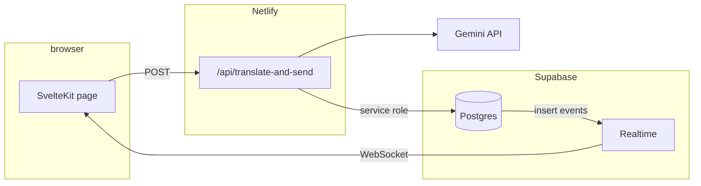

# CorpSpeak: hosting and data model

**Status:** reflects the current repository.

## Architecture

- **Netlify** hosts the SvelteKit app: static assets plus serverless **Netlify Functions** for SvelteKit server routes (including `/api/translate-and-send`).
- **Supabase** provides **Postgres** (durable messages) and **Supabase Realtime** so clients receive new rows without a long-lived WebSocket server in this app.
- **Google Gemini** translates user text in the API route before insert.

**Secrets:** `GEMINI_API_KEY` and `SUPABASE_SERVICE_ROLE_KEY` exist only in Netlify (or local `.env`); the browser uses `PUBLIC_SUPABASE_URL` and `PUBLIC_SUPABASE_ANON_KEY` for Realtime **subscribe** only.

## Implementation reference

- Design and schema: [docs/SUPABASE.md](docs/SUPABASE.md)
- SQL: `supabase/migrations/`

## Operator checklist

1. Supabase: run migrations; confirm Realtime on `corpspeak.messages` and that the `corpspeak` schema is API-exposed.
2. Netlify: set all env vars; deploy so `npm run build` runs with `PUBLIC_*` defined.
3. Optional hardening: tighten RLS, retention jobs, and auth (tracked in [PLAN.md](PLAN.md) as follow-ups).
