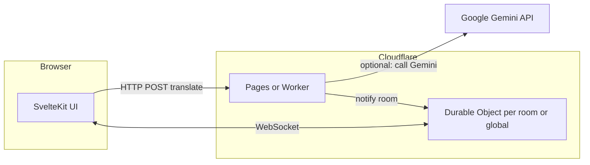

# Corpspeak: Migration off Convex + Free-Tier Realtime (High-Level Plan)

**Date:** 2026-04-22 · **Status:** research / architecture (one page)

## Current state (this repo)

- The codebase **does not use Convex in application code** today: it uses **SvelteKit**, a **Node `http` + `WebSocket` server** (`server.js` + `ws`), and a **Kit API route** for Gemini translation. Chat is **in-memory** (no durable history) and **broadcast-only** to currently connected clients.
- **PLAN.md** still describes a Convex-based path. This document is the target architecture if you adopt Convex later or need a “Convex replacement” for another branch/environment.

**Why this matters for migration:** “Moving off Convex” here mainly means **avoiding a paid BaaS** while keeping (or adding) **realtime delivery** and, if needed, a **durable data layer**.

## The hard problem: realtime on “static” or serverless hosts

- **Netlify, Vercel, and similar** serverless/edge function models are built for **request/response** work. They **do not** offer a first-class, long‑lived **in-process** WebSocket server the way a traditional Node app does. You typically **outsource** realtime to a system designed for it, or use a **platform** that can hold connection state.
- **Convex** combines DB + reactivity; replacing it is usually **(1) a database / API** plus **(2) a way to push updates** (WebSockets, SSE, or a managed channel service).

## Recommended hosting pattern (free-first)

| Approach | When to use it | Free-tier fit |
|----------|----------------|----------------|
| **A. All-in Cloudflare** — **Pages** (or Workers Sites) + **Workers** + **Durable Objects (DO)** with **hibernating WebSockets** | You want one vendor, edge deployment, and **native** chat/room state without a separate “chat SaaS” | **Strong:** Durable Objects are available on the **Workers free plan** (as of 2025); DOs are the natural place to hold room state and push to many clients. |
| **B. Static front + Supabase** — **Supabase Postgres** + **Realtime** (Broadcast / Postgres changes) | You want **message history**, auth, and **don’t** want to run your own websocket logic | **Strong:** free tier includes database + Realtime; good if you outgrow “broadcast only in RAM”. |
| **C. “Jamstack” host + third-party channels** — e.g. **Netlify** or **Cloudflare Pages** for UI + **PartyKit** / **Ably** / similar for rooms | You want the simplest front deploy and a managed **pub/sub** layer | **Good:** usually has a free tier; **more moving parts** and possible vendor message limits. |
| **D. Single long-lived Node (Fly.io, Railway, etc.)** | Reuse the **current** `server.js` + `ws` design with minimal change | **Weakest for “free”:** hobby tiers **sleep** or are **limited**; fine for prototypes, not ideal for “always on” at zero cost. |

**Best overall default for *free* + *control* + *realtime*:** **Option A (Cloudflare Workers + Durable Objects)**. You get a **single upgrade path** from today’s in-memory room to **per-room DOs** (or one DO for “global” chat) and optional **Durable Object storage / SQLite** for light persistence without paying for a separate database yet.

**Best default if you want *history* and *auth* without building websocket plumbing:** **Option B (Supabase)**.

## Target architecture (Cloudflare-first)

- **HTTP:** translation and rate limits stay in a **Worker** (or an external small API) with **secrets** for `GEMINI_API_KEY` (same pattern as today’s `translate-and-send` route).
- **Realtime:** clients connect to a **Durable Object** (not to a generic static host). The DO **broadcasts** new messages to WebSockets in that room. Use **hibernation WebSockets** where possible to limit idle cost.
- **Data:** start with **ephemeral in-DO state** to match “no history” behavior; add **Durable Object SQLite** or **D1** / external DB when you need history.

**If you choose Supabase instead:** store messages in **Postgres**, insert from an Edge Function or your API, and **subscribe** from the client with **Supabase Realtime** so you don’t maintain raw WebSocket servers on Netlify/Cloudflare Pages alone.

## Implementation phases (high level)

1. **Lock requirements:** in-memory only vs. message history, auth, and expected concurrent users (drives **DO vs. Supabase**).
2. **Extract interfaces:** in the app, isolate “send message” and “subscribe to messages” behind small modules so the UI can swap **Convex** / **WebSocket** / **Supabase channel** without churn.
3. **Deploy path:** if Cloudflare: add `adapter-cloudflare` (or split static UI + DO worker) and **move broadcast** from `globalThis.__corpspeak_broadcast` in Node to the **Durable Object**; if Supabase: replace WebSocket with Realtime + optional REST/RPC.
4. **LLM and secrets:** keep API keys in **Cloudflare secrets** or **Supabase Edge Function** secrets—never in the client.
5. **Decommission:** remove Convex (if used elsewhere), old Node `server.js` entry, and unused `ws` process glue once traffic is on the new path.

## Summary recommendation

- For **max free coverage** and a **first-class** model for “many clients, one room, push updates,” standardize on **Cloudflare (Pages + Workers + Durable Objects + WebSockets)**. Treat **Netlify** (alone) as **UI + API** only, with realtime handled by **option B or C** if you keep Netlify for the app shell.
- Add **Supabase** when you need **durable history, RLS, and built-in Realtime** without building DO logic yourself.

This plan fits Corpspeak’s current “translate then broadcast” flow and scales to multi-room and persistence when you are ready.

**Implementation for Option B (Supabase) in this repo:** see [docs/SUPABASE_MIGRATION_OPTION_B.md](docs/SUPABASE_MIGRATION_OPTION_B.md) and `supabase/migrations/`.
