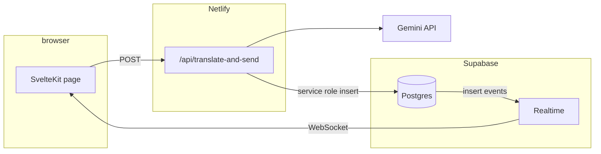

# CorpSpeak — Supabase (Postgres + Realtime)

The app is deployed on **Netlify** (SvelteKit static + functions). **Supabase** holds message history and powers **Realtime** so clients do not depend on a custom WebSocket server in this repo.

## Goals

1. **Persist** each translated message as a row in `public.messages` and deliver new rows to subscribers via **`postgres_changes`**.
2. **Keep** the product rule: the client sends raw text → the API calls Gemini → **only the translated (corp-speak) text** is stored and shown.
3. **Separate secrets:** `SUPABASE_SERVICE_ROLE_KEY` is server-only; the browser uses `PUBLIC_SUPABASE_URL` and `PUBLIC_SUPABASE_ANON_KEY` for **subscribe** (and future auth).

## Architecture

- **Service role** runs only in the API route; inserts are not done from the browser with the anon key.
- **Anon** can `SELECT` per RLS so Realtime can deliver inserts to subscribed clients; tighten policies if you add auth (see follow-ups in [PLAN.md](../PLAN.md)).

## Work breakdown (for contributors)

| Stage | Scope | Outcome |
|-------|--------|---------|
| **1** (done) | Schema + RLS + Realtime publication; env; API inserts; page subscribes to `INSERT` on `public.messages` | End-to-end with a dev Supabase project |
| **2** | Stricter RLS, RPC-only insert if you want to avoid service role in the function | Hardening for a public app |
| **3** (done) | Retention: cap total rows at 100 (newest by `created_at`) via `prune_messages_to_limit` RPC; Netlify `prune-messages-scheduled` hourly | Ops matches product copy |
| **4+** | Supabase Auth, multi-room routes, move Gemini to an Edge Function | [PLAN.md](../PLAN.md) backlog |

## Data model

- `public.messages`: `id` (UUID), `room_id` (text, default `general`), `author_name`, `body` (translated), `created_at` (timestamptz).
- **RLS:** allow **anonymous `SELECT`** for Realtime delivery with the anon key; **no** `INSERT` for `anon` (inserts go through the API with the service role).

## Retention

- SQL function `public.prune_messages_to_limit(p_keep integer default 100)` deletes older rows so at most `p_keep` messages remain globally (ordered by `created_at desc`, then `id desc`). Only `service_role` may execute it.
- **Production:** Netlify scheduled function `netlify/functions/prune-messages-scheduled.mjs` runs hourly on **production deploys** (see [netlify.toml](../netlify.toml); Netlify does not run schedules on deploy previews). Set optional `MESSAGE_RETENTION_KEEP` in Netlify env to override the default cap.
- **Manual / local:** after applying migrations, `npm run prune` (uses `SUPABASE_*` from `.env`) or run `select public.prune_messages_to_limit(100);` in the SQL editor.

## Deployment checklist

1. Create a Supabase project; run the SQL in `supabase/migrations/`.
2. In **Netlify** (site → Environment variables), set: `GEMINI_API_KEY`, `SUPABASE_URL`, `SUPABASE_SERVICE_ROLE_KEY`, `PUBLIC_SUPABASE_URL`, `PUBLIC_SUPABASE_ANON_KEY`. The `PUBLIC_*` variables must be present **at build time** so the client can subscribe to Realtime.
3. Redeploy after changing `PUBLIC_*` or Supabase keys.

## Risks and mitigations

| Risk | Mitigation |
|------|------------|
| Broad anon read in SQL | Tighten RLS when you add users; narrow `SELECT` to authenticated roles or time windows |
| Service role in API | Key only in server env; rotate in Supabase if leaked |
| Realtime quiet | Ensure the table is in the `supabase_realtime` publication; enable Realtime in the Supabase dashboard |

## References

- [Supabase Realtime: Postgres changes](https://supabase.com/docs/guides/realtime/postgres-changes)
- [Netlify + SvelteKit](https://docs.netlify.com/integrations/frameworks/sveltekit/)
