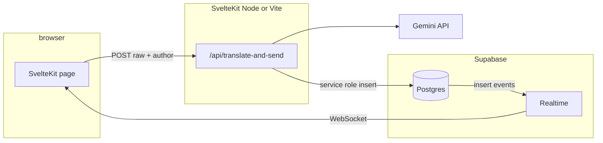

# Corpspeak — Migration Option B (Supabase) — Design & Plan

**Option B** in [MIGRATION_PLAN.md](../MIGRATION_PLAN.md) is: **static or Node-hosted UI** + **Supabase Postgres** + **Supabase Realtime** so you get durable messages, RLS-friendly auth later, and **no in-process WebSocket** server in the app.

## Goals

1. **Replace** in-process `ws` broadcast with **Postgres `INSERT` + `postgres_changes` Realtime** (one row per translated message).
2. **Keep** the existing flow: client sends raw text → SvelteKit API calls Gemini → **only the translated (corp-speak) text** is what gets stored and broadcast.
3. **Preserve** a **legacy mode** (no Supabase env) so `npm run dev` / self-hosted works without a Supabase project until you enable it.
4. **Unblock** “README Option B”: with Supabase enabled, `npm run dev` still gets **multi-tab realtime** (no local `/ws` required).

## Architecture (target)

- **Server secret:** `SUPABASE_SERVICE_ROLE_KEY` only on the server; inserts happen only in the API route (bypassing RLS or via policy — we use service role in code).
- **Client:** `PUBLIC_SUPABASE_URL` + `PUBLIC_SUPABASE_ANON_KEY` for Realtime **subscribe** and optional future auth; **no** service key in the browser.

## Day-sized work chunks (≈1 person-day each)

| Day | Scope | Outcome |
|-----|--------|---------|
| **1** | Schema + RLS + Realtime publication; env contract; `translate-and-send` inserts when Supabase is configured; `+page` subscribes to `INSERT` on `public.messages` | End-to-end with a dev Supabase project; dual transport still supported |
| **2** (optional) | Tighten RLS (e.g. `authenticator` role), separate “insert via RPC only” if you want stricter than service-role-only API | Hardening for public internet |
| **3** (optional) | **Retention** job: delete rows older than N hours, or **truncate**-style “ephemeral but debuggable” | Aligns product copy with ops reality |
| **4+** (optional) | **Auth** (Supabase Auth), multi-room `room_id` routes, Edge Function move for Gemini | [PLAN.md](../PLAN.md) backlog |

This delivery implements **Day 1** in code. Days 2–4 are follow-ups and are not required to merge Option B.

## Data model

- `public.messages`: `id` (UUID), `room_id` (text, default `general`), `author_name`, `body` (translated), `created_at` (timestamptz).
- **RLS:** allow **anonymous `SELECT`** so Realtime can deliver inserts to the browser with the anon key; **no** `INSERT` for `anon` (inserts go through the API with the service role).

## Deployment checklist (operator)

1. Create a Supabase project; run the SQL in `supabase/migrations/`.
2. In your host (e.g. Render), set: `GEMINI_API_KEY`, `SUPABASE_URL`, `SUPABASE_SERVICE_ROLE_KEY`, `PUBLIC_SUPABASE_URL`, `PUBLIC_SUPABASE_ANON_KEY` (Vite public vars must be present at build time for static embedding — see README).
3. Rebuild the app so `PUBLIC_*` is baked in; deploy.

## Decommissioning legacy WebSocket

When Supabase is fully configured, `server.js` **skips** attaching the WebSocket server; `globalThis.__corpspeak_broadcast` is a no-op. The `ws` package remains a dependency for environments that run **without** Supabase (legacy path).

## Risks and mitigations

| Risk | Mitigation |
|------|------------|
| Anon can read all stored messages in SQL | Tighten RLS in Day 2; reduce `SELECT` to authenticated users or time-window views |
| Service role in API route | Key only in server env; never in client; rotate in Supabase if leaked |
| Realtime not receiving events | Ensure table is in `supabase_realtime` publication; check dashboard Realtime is enabled |

## References

- [MIGRATION_PLAN.md](../MIGRATION_PLAN.md) — Option B summary
- [Supabase Realtime: Postgres changes](https://supabase.com/docs/guides/realtime/postgres-changes)
